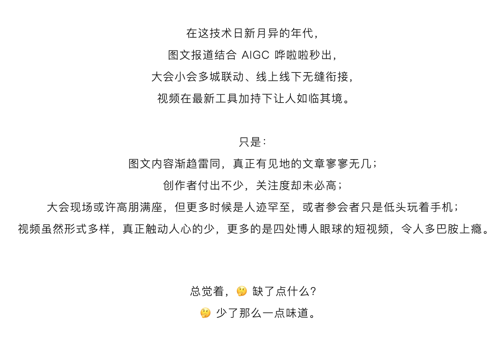

# 2023TechPodFest

于是，我们想着就邀请早期的技术播客创作者，联合一众技术社区，一起来搞搞事情。

去年仲夏时节，首届技术播客月技术播客之间的梦幻联动，已经有了一次非常不错的共创基石，我们也感受到了社区共创共建的力量。

今年，志同道合的一群伙伴（2023技术播客节组委会，AKA 搬砖🧱组）再接再厉，目前集结了30+播客、5大出品人、20+社区，同时定向邀约技术大V/ 跨界大牛等一起参与共建，一起用声音来表达输出，建设自家技术影响力。

本次共建，我们同时也得到了苹果播客、小宇宙、喜马拉雅等播客平台的官方大力支持，期待以更大阵容、更多元话题、更广参与场域，为大家沉淀一波又一波的优质音频内容（陪伴听物）。

#2023技术播客节 主打一个多元，内容划分为四大板块，既有面向开发者的「硬核技术」，也有打开眼界的「技术与商业」；既有社会大学般的「技术从业指南」，也有「技术与跨界」36行朋友圈的多彩世界

## 活动安排
11月13日-12月3日，连续三周，各家播客及社区陆续发出各自听友邀请函/ 节目单/ 金句海报/ 预热音视频内容；

12月4日-12月9日，连续六天，每天发布 5～8 期内容；

12月9日下午，播主和听友 Happy Hour，say个嗨，碰个杯，对个眼神。

